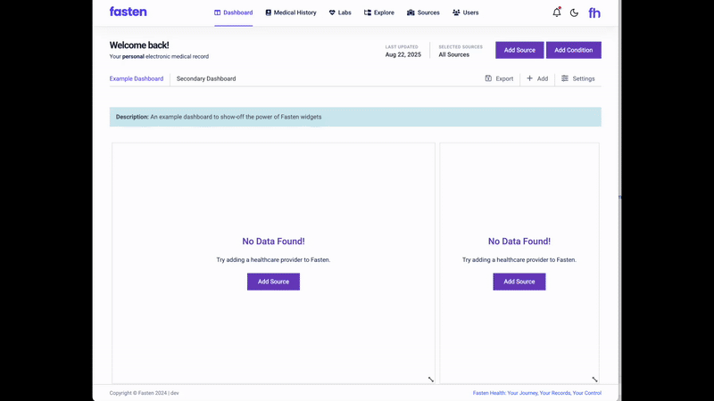

<div align="center">


<div style="display: flex; align-items: center; justify-content: center; gap: 40px; margin: 20px 0; flex-wrap: wrap;">
  <div style="flex: 1; min-width: 280px; max-width: 500px; text-align: left;">
    <h3 style="font-size: clamp(1.5rem, 4vw, 2.5rem); margin-bottom: 16px; text-align: left;">One app. All your medical records, safe and ready.</h3>
    <p style="font-size: clamp(1rem, 2.5vw, 1.2rem); line-height: 1.6; margin-bottom: 20px; text-align: left;"><strong>No more forms. No more repeating yourself.</strong> With HealthWallet.me, your health info is always safe and easy to share.</p>
    <div style="display: flex; gap: 12px; margin-top: 20px; flex-wrap: wrap;">
      <a href="https://apps.apple.com/app/healthwallet-me/id6748325588" style="background: #dee2fe; color: #2C2D30; padding: 12px 24px; border-radius: 12px; text-decoration: none; font-weight: bold; box-shadow: 0 4px 8px rgba(0,0,0,0.2); display: flex; align-items: center; font-size: clamp(0.9rem, 2vw, 1rem); min-width: fit-content;">
         Download for iOS
      </a>
      <a href="https://play.google.com/store/apps/details?id=com.techstackapps.healthwallet" style="background: #dee2fe; color: #2C2D30; padding: 12px 24px; border-radius: 12px; text-decoration: none; font-weight: bold; box-shadow: 0 4px 8px rgba(0,0,0,0.2); display: flex; align-items: center; font-size: clamp(0.9rem, 2vw, 1rem); min-width: fit-content;">
         Download for Android
      </a>
    </div>
  </div>
  <div style="flex: 1; min-width: 280px; text-align: center; display: flex; justify-content: center; align-items: center;">
    
  </div>
</div>
</div>

<p align="center">
  <a href="changelog.md">
    
  </a>
  <a href="https://www.linkedin.com/company/techstackapps/">
    
  </a>
</p>

## 📋 About

**HealthWallet.me** is a **secure**, **patient-controlled**, **community-driven** health record platform that consolidates your medical data from multiple providers into one accessible app.

### Key Benefits
- **Patient-Centered** • **Privacy-First** • **FHIR Compliant** • **Offline Capable**

## ✨ Features

- 🔐 **Secure Storage** - Biometric authentication
- 🏥 **Health Records Management** - Comprehensive view of medical history
- 📊 **Dashboard** - Centralized health information overview
- 🌐 **Offline Support** - Access critical data without internet
- 🌍 **Global Access** - Works worldwide with International Patient Summary


## 🚀 Getting Started

### 📱 Download the Mobile App
Get HealthWallet.me from your app store:
- **[iOS App Store](https://apps.apple.com/app/healthwallet-me/id6748325588)** 
- **[Google Play Store](https://play.google.com/store/apps/details?id=com.techstackapps.healthwallet)**

### 🏠 Self-Hosted Backend ([FastenHealth](https://github.com/fastenhealth/fasten-onprem))
The backend server aggregates medical records from healthcare providers and syncs them with your mobile app.

**Prerequisites:**
- Docker installed on your computer ([Install Docker](https://docs.docker.com/get-docker/))
- A computer/server that can run 24/7 (for automatic syncing)

**Quick Setup:**

1. **Download the necessary files:**
   ```bash
   curl https://raw.githubusercontent.com/fastenhealth/fasten-onprem/refs/heads/main/docker-compose-prod.yml -o docker-compose.yml
   curl https://raw.githubusercontent.com/fastenhealth/fasten-onprem/refs/heads/main/set_env.sh -o set_env.sh
   ```

2. **Configure your environment:**
   ```bash
   chmod +x ./set_env.sh
   ./set_env.sh
   ```

3. **Start the backend server:**
   ```bash
   docker compose up -d
   ```

4. **Access your FastenHealth dashboard:**
   Open your browser and go to `http://localhost:9090`

5. **Create your account:**
   - Click "Sign Up" on the login page
   - Choose a username and password (e.g., `testuser` / `testuser`)

### 🔄 Connecting Everything Together
1. **Generate access token** in your FastenHealth dashboard
2. **Scan** the generated **QR code**
3. **Sync your health records** automatically

<div align="center">
  
</div>

## 🛠️ Development Setup

### Prerequisites
- Flutter SDK (>=3.0.0)
- Dart SDK (>=3.0.0)
- Android Studio or VS Code with Flutter extensions

### Quick Start
1. **Install FVM (Flutter Version Management)**
   ```bash
   dart pub global activate fvm
   fvm install
   fvm use
   ```

2. **Install development dependencies**
   ```bash
   flutter pub get
   flutter pub run build_runner build --delete-conflicting-outputs
   ```

3. **Run tests**
   ```bash
   flutter test
   ```

## 🏗️ Architecture

### Tech Stack
- **Framework**: Flutter 3.0+
- **Language**: Dart 3.0+
- **State Management**: BLoC (flutter_bloc)
- **Dependency Injection**: GetIt + Injectable
- **Navigation**: Auto Route
- **Local Storage**: Drift (SQLite)
- **Network**: Dio
- **Code Generation**: Freezed, JSON Serializable
- **Localization**: Flutter Intl

### Project Structure
```
lib/
├── app/                    # App configuration and initialization
├── core/                   # Core utilities, constants, and shared code
│   ├── constants/         # App constants and configurations
│   ├── errors/            # Error handling and custom exceptions
│   ├── network/           # Network configuration and interceptors
│   ├── storage/           # Local storage implementations
│   └── utils/             # Utility functions and helpers
├── features/              # Feature modules
│   ├── auth/              # Authentication feature
│   ├── dashboard/         # Main dashboard
│   ├── health_records/    # Health records management
│   ├── sync/              # Data synchronization
│   └── profile/           # User profile management
└── gen/                   # Generated code (assets, routes, etc.)
```


## 🗺️ Roadmap

### Phase 1: Core Platform (Current)
- ✅ Basic health record management
- ✅ Authentication and security
- ✅ Cross-platform support

### Phase 2: Advanced Features
- 🔄 QR code sharing (SMART Health Cards)
- 🔄 Proximity-based communication
- 🔄 Document scanning & OCR
- 🔄 File import & in-app viewing
- 🔄 Responsive UI & CRDT backup system
- 🔄 Wearable & health provider integration
- 🔄 Internationalization
- 🔄 AI health insights

### Phase 3: Ecosystem
- 🔄 Family management
- 🔄 Provider portal
- 🔄 Analytics & integration


## 🤝 Contributing

We welcome contributions! See our [Contributing Guide](CONTRIBUTING.md) for:
- Code style and standards
- Pull request process
- Development setup

**Quick Start:**
1. Fork the repository
2. Create a feature branch
3. Make your changes
4. Submit a pull request

## 👥 Authors

- **Alex Szilagyi** - Initial Development - [@alexszilagyi](https://github.com/alexszilagyi)
- **Jason Kulatunga** - Co-Author - [@AnalogJ](https://github.com/AnalogJ)

## 🙏 Acknowledgments 
- **FHIR Community** - For the healthcare interoperability standards
- **Open Source Contributors** - For the libraries and tools that make this possible
- **Healthcare Providers** - For feedback and requirements

## ⭐ Rate Our App

If you find **HealthWallet.me** helpful, please consider rating us in the app stores:

<div align="center">

[](https://apps.apple.com/app/healthwallet-me/id6748325588)
[](https://play.google.com/store/apps/details?id=com.techstackapps.healthwallet)

</div>

Your ratings help us improve and reach more people who need better health record management!
